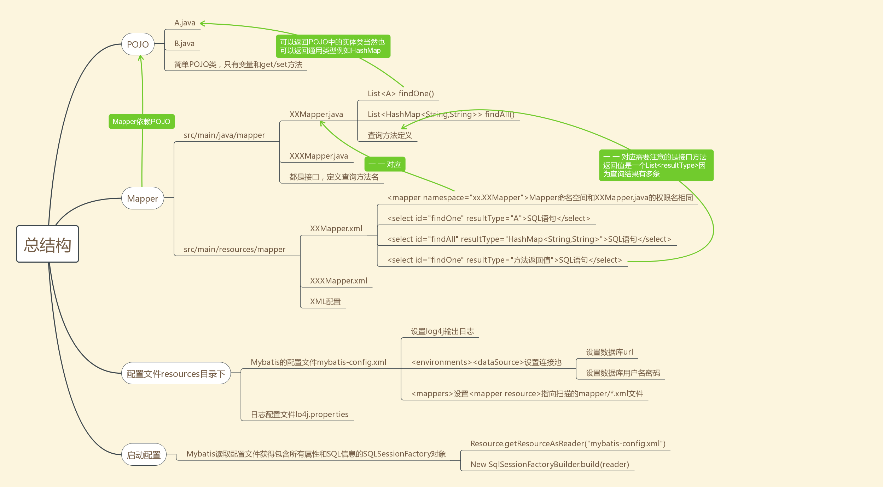

# 第一节
配置Mybtis让其可以跑起来

主要结构如下：

## 配置Mybatis
 主要有两种方式 
 
 1 基于XML的配置方式,这里我们基于第一种
 

 在main/resources下创建mybatis-config.xml文件，记录Mybatis的配置信息
 
 头文件：
 
    
    <?xml version="1.0" encoding="UTF-8"?>
    <!DOCTYPE configuration PUBLIC "-//mybatis.org//DTD Mapper 3.0//EN" "http://mybatis.org/dtd/mybatis-3-config.dtd">
    
    <configuration>
        
    </configuration>
 主要配置数据库连接池和mapper SQL语句映射文件的绝对路径

 
 2 集成Spring时的配置方式

## 创建POJO类

创建一个普通的POJO

## 创建Mapper

分为两个部分：

1 java下的Mapper接口

2 resources下的Mapper.xmlSQL文件

    <?xml version="1.0" encoding="UTF-8"?>
    <!DOCTYPE mapper PUBLIC "-//mybatis.org//DTD Mapper 3.0//EN" "http://mybatis.org/dtd/mybatis-3-mapper.dtd">
    
    <mapper namespace="mapper.ItemMapper">
        <select id="getAllItem" resultType="pojo.Item">
            SELECT num,price, id,title FROM tb_item;
        </select>
    
    </mapper>

注意的是两者的对应关系：

A Mapper.xml中的Mapper nameSpace要和 Mapper接口全名对应

B 单独select指令的id resultType要和 Mapper接口方法定义的信息对应

## 运行

我们这里先专注于Mybatis在Mapper上的使用，至于Service和Web如何整合放在后面
使用一个Test使得Mybatis跑起来

A Mybatis初始化配置部分：

读取Mybatis-config.xml配置文件
之后mappers会读取所有的Mapper.xml文件进行具体方法的解析
解析完成之后得到的是一个包含所有属性配置和SQL信息的SqlSeesionFactory

B 利用SQLSessionFactory获取SQLSession对象

这个SqlSession对象才是真正执行 sqlSession.selectList("SQL语句id")

这里注意的是这个方法利用的是SqlSession自己本身的selectList方法通过命名空间调用方法，这是属于Myabtis2的方法
在Mybatis3中使用动态代理直接调用接口方法，在第二节中讲到
并没有使用Mapper中定义的接口方法，不过在后面会用到的
这里先跑起来而已

C 使用完SqlSession之后不要忘记close();
